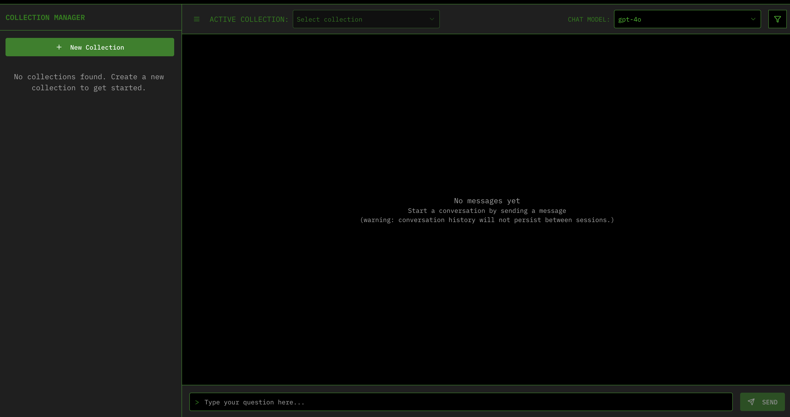
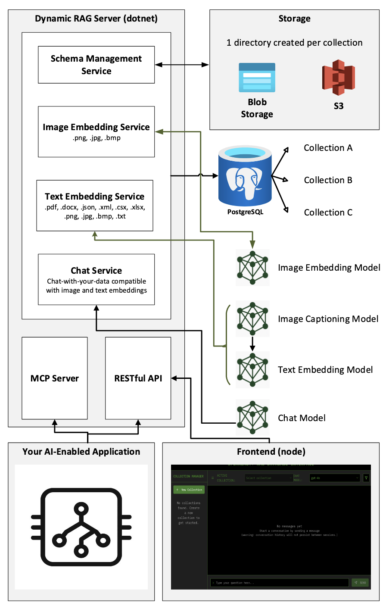

# Dynamic Retrieval Augmented Generation

This project provides a database driver (dotnet) and frontend (react) for a retrieval augmented generative database in PostgreSQL. It is required that the postgres server and database are created in advance of running the driver, but the driver will maintain the schema, model registrations to collections, and ingestion/retrieval of embeddings to the collections. 

This project is referred to as "dynamic" for two primary reasons. First, the database will label, track and enforce compatibilitiy of embedding versions and indexes in the database - this automated process is intended to simplify the management of different collections using different embedding models based on performance requirements. Second, the ingestion of files overruning the context window of the slected embedding model will be managed dynamically with a recursive, mime-type-specifc chunking algorithm that is intended to enable enbedding data from files of arbitrary length, as efficiently as possible from the server side. Note that token rate limits at the deployment should still be maintained and monitored by the user.

It is not required to host the frontend, as all operations in the server are available programatically. The frontend is intended just to be a configuration manager and does not maintain conversations or persist user logins. Visiting the root URL of the hosted server in your web browser will display an interactive swagger spec to test various GET/POST operations. Therefore, the server can be integrated directly as an API and configured programatically. The collections can also be queried programatically. There may be some use cases where users may want to pre-configure collection data from the frontend, and retrieve/chat via the backend - this is a supported pattern. Note that the frontend is not recommended to be used in production applications as it is not integrated with OAuth in this demonstration. The server should be provided with an API Gateway or API-Management service, for at least key-based authentication.

Currently, the server supports models from Azure and AWS/Bedrock providers. More specific instructions on the configuration will be provided in the server README.

## System Diagrams

The sample frontend image below shows the configuration management UI. In this case, there are no collections configured but they can be easily added via the collections dialogue on the left pane. On the top toolbar, users can switch between collections for chat and sample retrievals or add more precise filters to the retriever like time window gating and recency decay.

The system diagram below details the interfaces, services, and required resources to support and integrate the Dyanmic RAG server.

 - **Interfaces**: the server can be integrated directly with the end-application via RESTful API integration or MCP client-server protocol. The MCP server endpoints hosted on the dotnet server can be hit from both streamable HTTP (remote) or SSE (local) MCP clients. Additionally, the accompanying frontend (node) can be hosted for quick configurations and data management.
 - **Services**: the server supports 4 primary services. First, the "Schema Management Service", maintains collection consistency, model registations, and add/remove table operations. Second, the "Image Embedding Service" maintains ingest/retrivals of .png/.jpg/.bmp images to image collections, if the Image Embedding Model (i.e. CLIP) is available. Third, the "Text Embedding Service", maintains ingest/retieval of text data (and automated image captioning) for standard collections supporting 10 file types. Last, the "Chat Service" allows users to sample chat-responses with their collection's embeddings.
 - **Required resources**: Via environment variables to the server, the user must provide an artifact store (S3 or blob), a postgres database with the PgVector extension installed, and model endpoints via either Azure or AWS dictionary/subscription sourcing. More details provided on model configurations within the ./server directory. Resource configruations (storage connection paramerers, database connection parameters, model sources and/or endpoints) can be configured via environment variables to the server.

## Current Support
- Text Embedding Collections
    - support for embeddings (ingestion) and retrievals from 10 file types: docx, xlsx, csv, pdf, txt, png, bmp, jpeg, xml, json.
    - Vector Search (cosine), Semantic Search (BM25), and Hyrbid Search (Reciprocal Rank Function)
    - chat-with-your data (for debug only) not supporting streaming, not optimized for inference latency
- Image Embedding Collections
    - support for embedding (ingestion) and retrievals from 3 file types: png, jpg/jpeg, bmp
    - Text-to-Image vector search, and Image-to-text vector search
    - chat-with-your data (for debug only) not supporting streaming, not optimized for inference latency.
- custom collection creation (and complete lifecycle management) with a preassigned embedding type (image or text imebeddings)
- Storage, and model sourcing from Azure OpenAI and AWS Bedrock, with environment variable key-value pair patterns to extend to custom endpoints with key-based authentication.
- automated schema management, embedding model assignment and enforcement, automated indexing and udpates for efficient search.

## Prerequisites

- [.NET SDK 9.0](https://dotnet.microsoft.com/download/dotnet/9.0) or later
- [PostgreSQL](https://www.postgresql.org/download/) (version 16.4 recommended) with the [PgVector extension installed, automatic at startup of the server](https://github.com/pgvector/pgvector)
- Access to Azure OpenAI services (for embedding models)

---

## Setup Instructions

Setup instructions for each service are located in their respective subfolders:

- **Server (C#/.NET API):**  
  See [`server/README.md`](server/README.md) for environment setup, configuration, build, and run instructions.

- **Frontend:**  
  See [`frontend/README.md`](frontend/README.md) for frontend setup and usage instructions.

- **Unit Tests:**  
  See [`Tests/ServerTests/README.md`](Tests/ServerTests/README.md) for running and configuring unit tests.

---

## License Summary

This software is licensed under the BSD-3-Clause License.

For full license details, see [`LICENSE`](LICENSE).

---

## Developer Guidelines

### Code Quality and Testing
- **Unit Tests**: All unit tests must pass locally prior to submitting merge requests and pull requests
- **Testing Framework**: Comprehensive tests covering all 19 API endpoints are documented in the [Server Integration Tests README](./Tests/ServerTests/README.md)
- **Pre-commit Requirements**: Ensure all tests pass before committing changes

### Support and Collaboration
- **Issue Support**: Sony Pictures Entertainment does not provide an SLA for responding to issues, bug reports, or feature requests
- **External Collaboration**: External collaboration and contributions are encouraged and welcome
- **Community Guidelines**: Please follow standard open-source collaboration practices when contributing

### Infrastructure and Deployment
- **Cloud Provider Support**: Build scripts and deployment configurations for AWS, GCP, Oracle Cloud, and Azure are encouraged contributions but not provided by default
- **Custom Deployments**: Users are encouraged to create and share deployment scripts for their preferred cloud providers
- **Infrastructure as Code**: Contributions of Terraform, CloudFormation, or other IaC templates are welcome

### Development Standards
- **Code Review**: All changes should be reviewed through the standard pull request process
- **Documentation**: Update relevant documentation when making changes to APIs or functionality
- **Backward Compatibility**: Consider backward compatibility when making breaking changes

---

## Developers

Bryan Bednarski - core services including text-to-text, text-to-image, and image-to-image retrieval. Server, Frontend, and Unit Testing Framework

Rohit Pulipaka - extended unit tests for core services, schema creation

Praveen Jaikant - infrastructure as code and model deployments.

Aditya Tahilramani - advisor

---
